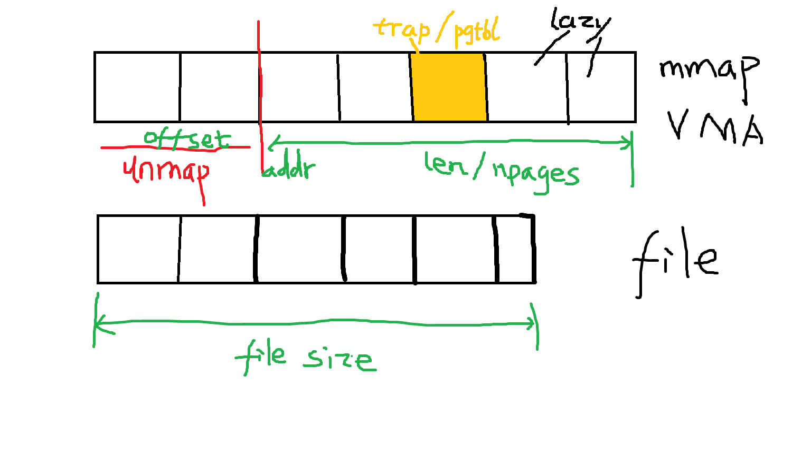

### Baker algorithm
#### 概念
在垃圾收集器的概念中，可达性和不可达性是判断对象是否需要被回收的关键标准：

可达性

从根节点（Root Nodes）出发，通过引用链能够访问到的对象为可达对象        
这些对象正在被程序使用，因此不会被垃圾回收


不可达性

从根节点出发，无法通过任何引用链访问到的对象为不可达对象        
这些对象已经不再被程序使用，可以被垃圾收集器安全地回收

根节点通常包括：

栈中的本地变量
方法区的静态变量
JNI引用
活动线程

mutator：程序       
collector: garbage collector
#### 基本原理
1. 将堆内存划分为两个等大的空间：from-space和to-space
2. 对象从from-space复制到to-space
3. 存活的对象被压缩到to-space的连续区域
4. 复制后交换from-space和to-space的角色
#### 算法流程
初始状态：
- from-space：当前使用的内存空间
- to-space：空闲空间，用于接收存活对象

垃圾回收步骤：

a) 从根节点开始遍历     
b) 找到所有可达对象     
c) 将可达对象复制到to-space     
d) 更新对象引用     
e) 交换from-space和to-space     

#### 应用VM解决并发问题
关键思路：
- 利用虚拟内存机制
- 通过页错误（Page Fault）触发垃圾回收
- 避免对每条指令的额外开销

页扫描机制：    
a) 将未扫描区域设置为不可访问   
b) 当程序访问该区域时触发页错误     
c) 垃圾收集器立即扫描触发错误的页面     
d) 标记和处理页面中的引用   
e) 解除页面保护     

### mmap实验
#### 时间
2024/11/19 9:30开始
2014/11/20 9:00ALL TEST PASED
```
make grade
== Test running mmaptest == 
$ make qemu-gdb
(6.4s) 
== Test   mmaptest: mmap basic == 
  mmaptest: mmap basic: OK 
== Test   mmaptest: mmap private == 
  mmaptest: mmap private: OK 
== Test   mmaptest: mmap read-only == 
  mmaptest: mmap read-only: OK 
== Test   mmaptest: mmap read/write == 
  mmaptest: mmap read/write: OK 
== Test   mmaptest: mmap dirty == 
  mmaptest: mmap dirty: OK 
== Test   mmaptest: not-mapped unmap == 
  mmaptest: not-mapped unmap: OK 
== Test   mmaptest: lazy access == 
  mmaptest: lazy access: OK 
== Test   mmaptest: two files == 
  mmaptest: two files: OK 
== Test   mmaptest: fork_test == 
  mmaptest: fork_test: OK 
== Test   mmaptest: munmap_noaccess == 
  mmaptest: munmap_noaccess: OK 
== Test   mmaptest: read_only_write == 
  mmaptest: read_only_write: OK 
== Test usertests == 
$ make qemu-gdb
usertests: OK (101.8s) 
== Test time == 
time: OK 
Score: 170/170
```

#### 实验分析
mmap中有很多设计的细节需要考虑。
##### VMA的设计以及在mmap/munmap下的状态变化
vma数据结构设计如下：
```c
struct vma{
  uint64 addr;//vma的开头地址
  size_t len; //vma的区域长度，在mmaptest里都是PGSIZE的倍数，为简化问题，使用这一假设
  int prot; //read/write/exec
  int flags;  //map_Shared/Private
  int fd;
  off_t offset; //假定了file的offset为0，因此vma的offset就是addr与file开头的offset
  struct file *vfile;
  int npages; //vma的pages数量
};
```

随着munmap的调用，可能vma的addr也会随之变化。相应的npages/len/offset也要随之变化。参见下图

这里实现的是lazyily mapped。只有当map到的Page真的需要被读写时才会分配内存。   
mmap的实现很简单，将参数记录到VMA中、更新file refcnt、更新process size、检查mmap权限是否合理。      
munmap实现中的循环体内的数字计算可以参考上图。思路是    
- 首先在unmap的区域里找到已经在pgtbl里分配内存的页
- 计算当前页的位置与file开头的offset;计算要写入file的数据大小n（可能小于一个页，比如file的末尾可能占据不到一个页
- 模仿filewrite函数，实现将虚拟地址为va,写入位置为文件的offset,写入size为n的munmap_filewrite函数
munmap也要更新VMA的数据结构。
##### 权限管理
在通过调用mmap时，要注意map_shared和prot_write同时满足时，file必须是writable的。  
在trap程序中，r_scause()=15意味着store page fault,这时要判断是否有prot-Write的权限。    
将写页（内存）和写入文件分开来。    
在munmap时需要将dirty page写入文件中。但是首先要判断can_write这个权限
##### 其他细节
1. 用户页面必须有PTE_U这个标志
2. 当unmap的虚拟地址或trap到的虚拟地址不在VMA结构的已经map的区域中，报错。
3. 在test fork中, uvmcopy/uvmunmap时遇到PTE not valid的页面，don't panic,just continue。这是lazily mapped导致的。

